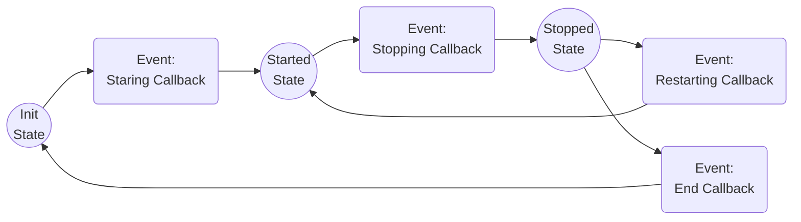

# FSM Library Example

Simple finite state machine example.



## Requirements

Install GCC, make, and CMake

## Build

```makefile
mkdir build
cd build
cmake ..
make
```

## Run

Running the program via terminal

```makefile
make launch
```

## VSCode debugging

Simple configuration when using VSCode to debug

```debug
{
    "name": "Example Launch (GDB)",
    "type": "cppdbg",
    "request": "launch",
    "program": "${workspaceFolder}/example/build/example.out",
    "args": [],
    "stopAtEntry": true,
    "cwd": "${workspaceFolder}/example/",
    "environment": [],
    "externalConsole": false,
    "MIMode": "gdb",
    "setupCommands": [
        {
            "description": "Enable pretty-printing for gdb",
            "text": "-enable-pretty-printing",
            "ignoreFailures": true
        }
    ]
}
```